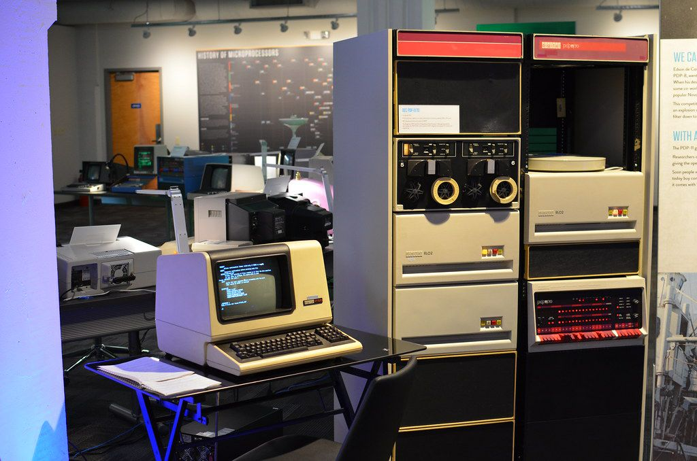

# Археология компьютеров
Компьютеры давно проникли в нашу повседневную жизнь. Любой современный
смартфон по вычислительной мощности превосходит все существовавшие
компьютеры в 60е. Это несёт в себе не только преимущества (например,
автоматизация производств всё глубже проникает в нашу экономику), но и
угрозы: простые пользователи прозрачны для гигантских компаний, да и
государства собирают информацию о своих гражданах, что даёт им потенциально
большую власть над нами. Чтобы понять, какими опасностями и возможностями
обладают компьютеры, надо вернуться к самым основам, и понять, как
компьютеры работают внутри. В этом и стоит задача вводного занятия.  Мы
доберёмся до самого фундамента: разберём основы бинарного кода, потом
перейдём на более высокий уровень и изучим основы операционной системы UNIX:
её наследники Android и MacOS являются самыми распространнёнными ОС (вы
наверняка используете из этих двух вариантов UNIX каждый день). В результате
после вводного занятия у участников будет представление о том, как работают
компьютеры внутри, и что на самом деле делают программы.

Image Copyright:
  - Author: Matthew Ratzloff
  - Title: DEC PDP-11/70
  - Date: June 29, 2013
  - License: [CC BY-NC-ND 2.0](https://creativecommons.org/licenses/by-nc-nd/2.0/)
  - [Flickr](https://www.flickr.com/photos/mratzloff/9169358863)
